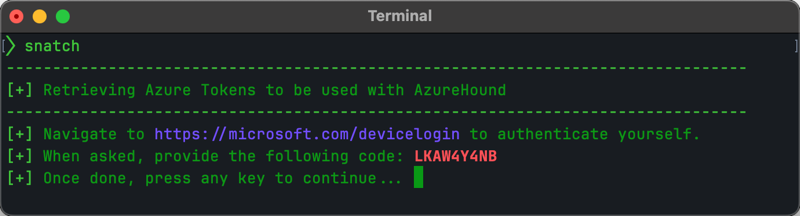
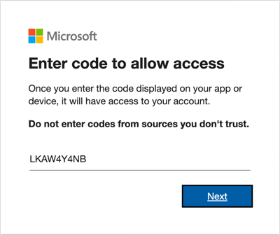
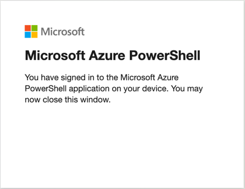
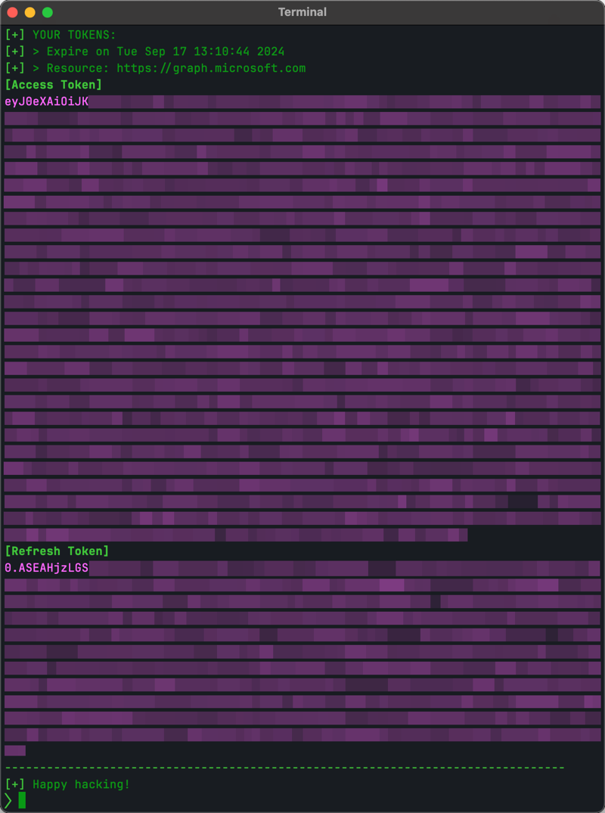

# Snatch

A helper tool to retrieve the tokens required by AzureHound. It relies on the
Azure PowerShell app (client id `1950a258-227b-4e31-a9cf-717495945fc2`) which is
available by default to all users.

Check out the [AzureHound Wiki](https://bloodhound.readthedocs.io/en/latest/data-collection/azurehound.html)
for the complete story.

## Usage

Run `snatch` from a terminal. It will get a Device Authentication code and ask
you to visit a URL to complete the authentication flow:



Enter the Device Code:



Complete the next steps to authenticate yourself. Once done, you will see the
following message:



Back to the terminal, press any key to retrieve the tokens:



Use the refresh token with AzureHound to query the MS Graph API. For example:

```
azurehound -r "0.ARwA6Wg..." list --tenant "contoso.onmicrosoft.com" -o output.json
```

## Installation

I recommend using [pipx](https://github.com/pypa/pipx) as it has become quite
the standard these days:

```
pipx install git+https://github.com/hakbyte/snatch
```

However if you don't want to use `pipx`,  just clone this repo and build the
tool locally:

```
python3 setup.py sdist bdist_wheel
```

The resulting package (e.g. `dist/snatch-0.1.0-py3-none-any.whl`) can be
installed using `pip`:

```
pip install dist/snatch-0.1.0-py3-none-any.whl
```
